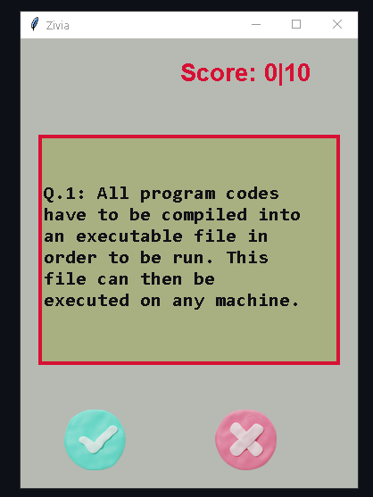

# Zivia Quiz App 🧠

Zivia is a simple desktop quiz application built with Python and Tkinter. It fetches true/false questions from the Open Trivia Database API and challenges you to test your knowledge. The application provides instant feedback and keeps track of your score as you play.

## Screenshot


<!-- ## Screenshot

-->

***
## Features ✨

* **Interactive GUI**: Simple user interface built with Tkinter.
* **Live Trivia Questions**: Fetches questions directly from the Open Trivia DB API.
* **Instant Feedback**: The screen turns green for correct answers and red for incorrect ones.
* **Score Tracking**: Keeps a running total of your score.
* **Cross-Platform**: Can be run directly on any OS with Python or as a Docker container.

***
## Quick Start with Docker (No Build Required)

If you have Docker installed, you can run the application immediately using the pre-built image from the GitHub Container Registry.

1.  **Pull the image from GHCR:**
    ```bash
    docker pull ghcr.io/samybit/zivia:1.2.1
    ```

2.  **Run the container:**
    * **On Windows (with VcXsrv running):**
        ```bash
        docker run -it --rm -e DISPLAY=host.docker.internal:0.0 ghcr.io/samybit/zivia:1.2.1
        ```
    * **On macOS (with XQuartz) or Linux:**
        ```bash
        docker run -it --rm -e DISPLAY=$DISPLAY -v /tmp/.X-unix:/tmp/.X-unix ghcr.io/samybit/zivia:1.2.1
        ```

***
## Development Setup

If you want to modify the code, you'll need to set up the project locally.

### Requirements

* Python 3.11+
* Docker Desktop (for containerized usage)
* Git

### Local Installation Steps

1.  **Clone the repository:**
    ```bash
    git clone [https://github.com/samybit/Zivia.git](https://github.com/samybit/Zivia.git)
    cd Zivia
    ```

2.  **Create a virtual environment (recommended):**
    ```bash
    python -m venv venv
    source venv/bin/activate  # On Windows, use `venv\Scripts\activate`
    ```

3.  **Install dependencies:**
    ```bash
    pip install -r requirements.txt
    ```

4.  **Run the application locally:**
    ```bash
    python src/zivia/main.py
    ```

### Building the Docker Image from Source

1.  **Build the Docker image:**
    From the root of the project directory, run:
    ```bash
    docker build -t zivia .
    ```

2.  **Run the locally built image (see run commands in the Quick Start section).**

***
## License

This project is licensed under the MIT License. See the `LICENSE` file for details.
